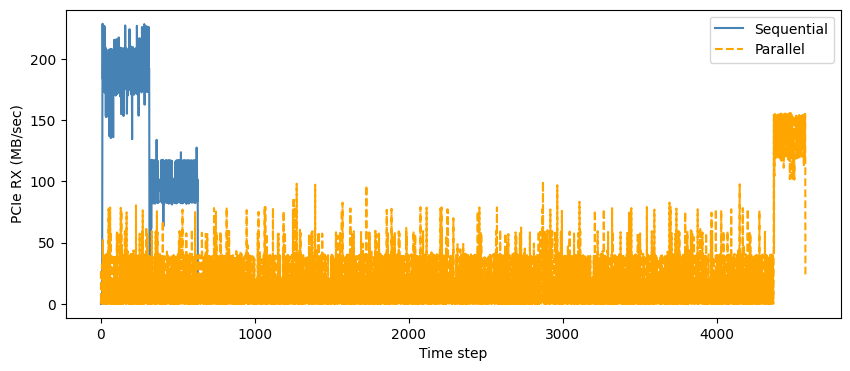

# Problem:
- Start with resnet-50 and vision transformer when collocated on a single gpu.

- Source of Contention
    - CPU
    - RAM Bandwidth
    - Disk I/O
    - PCIe Bandwidth

- Literature
    - keywords: Multiple GPU instance, deep learning, contention, PCIe (Optional)
    - Strong Connection:
        - [PCIe Bandwidth-Aware Scheduling for Multi-Instance GPUs (Model Slowdown Linearly)](./related_work/pcie_aware_strong.pdf)
        - [Elastic MIG Reconfiguration with PCIe-Aware Placement for Multi-Tenant GPUs](./related_work/elastic_pcie_aware_strong.pdf)
        - [Baymax: QoS Awareness and Increased Utilization for Non-Preemptive Accelerators in Warehouse Scale Computers](./related_work/Baymax_strong.pdf)
    - Weak Connection:
        - [Transparent GPU Sharing in Container Clouds for Deep Learning Workloads](./related_work/tgs.pdf)

- Scenarios of High PCIe Utilization
    - LLM inference but with CPU offloading

# Testbench
1- Explain selected workload:
    - Use nvbench to explain boundries
    - talk about selected workload as small, mid, and large pcie demanding workload
    - Q: Discuss the validity of the workload: Explain the limitation of the current workload, and what is used in the literature ?

# Methodology
1- Explain your methodology, what are you trying to achieve ?
    - Detection
    - Scheduling

# Results
1- present preliminary results.