```mermaid
flowchart LR
    subgraph CLIENT["Experiment client / Ansible host"]
        ORCH["Ansible sweep orchestration"]
        AIPERF["aiperf benchmark client"]
        WINDOWS["Benchmark time-window extraction"]
        ARTIFACTS["Benchmark artifacts"]
    end

    subgraph CLUSTER["Kubernetes cluster"]
        API["Kubernetes API server<br/>+ Kubernetes scheduler"]

        subgraph NODE["GPU worker node"]
            subgraph DEFAULT["default namespace"]
                RATE["Rate-control scheduler<br/>controller Pod / Go process<br/>GB_RATE, WORKER_IDS"]

                subgraph VLLM_POD["vLLM Job Pod"]
                    INIT["Init container<br/>wait-for-rate-control"]
                    WORKER["vLLM worker process<br/>LD_PRELOAD=/mnt/libvgpu.so<br/>SHARED_REGION_CACHE_ENV=rate-control-ops-ID"]
                end

                INGRESS["Ingress"]
                SERVICE["vLLM Service"]
            end

            HOSTPATH["Shared node hostPath: /tmp/rate-control<br/>rate-control-ops-ID (shared mmap: buckets + usage)<br/>ready-ops-ID and go-ops-ID"]
            RESULTS["Server results hostPath<br/>scheduler.csv and telemetry output"]
            LIB["HAMi-core libvgpu.so<br/>read-only hostPath mount at /mnt"]
            SCRAPER["Go metrics scraper<br/>server-side process"]

            subgraph NVIDIA["NVIDIA GPU Operator stack"]
                OPERATOR["NVIDIA GPU Operator"]
                DEVICE["NVIDIA device plugin<br/>advertises nvidia.com/gpu"]
                DCGM["DCGM Exporter"]
            end
            GPU["NVIDIA GPU"]
        end

        subgraph MONITORING["monitoring namespace"]
            PROM["Prometheus"]
        end
    end

    ORCH -->|"1. Apply vLLM Job / Service / Ingress, then controller Pod"| API
    API -->|"Create controller Pod"| RATE
    API -->|"Schedule worker Pod; allocate GPU resource"| WORKER
    DEVICE -->|"Advertise / allocate GPU resources through Kubernetes"| API
    OPERATOR -.->|"manages GPU components"| DEVICE
    OPERATOR -.->|"manages GPU components"| DCGM

    RATE -->|"2. Map and zero shared regions; then create ready file"| HOSTPATH
    RATE -->|"Write scheduler.csv"| RESULTS
    HOSTPATH -.->|"3. Init container sees ready file and exits"| INIT
    INIT -->|"4. Start main container"| WORKER
    LIB -->|"Mounted read-only; loaded via LD_PRELOAD"| WORKER
    WORKER <-->|" mmap shared buckets / usage;<br/>library consumes credits and records PCIe usage "| HOSTPATH
    ORCH -.->|"5. Touch go file after model readiness and warm-up"| HOSTPATH
    HOSTPATH -.->|"GO_FILE starts limit phase; scheduler resets state"| RATE
    RATE -->|"Refill per-worker byte buckets every 250 ms"| HOSTPATH

    ORCH -->|"6. Start measured run after limit phase is confirmed"| AIPERF
    AIPERF -->|"Measured OpenAI API requests via SSH tunnel"| INGRESS
    INGRESS --> SERVICE
    SERVICE --> WORKER
    WORKER -->|"GPU work and PCIe traffic, rate-limited by preload library"| GPU
    GPU -->|"GPU / PCIe telemetry"| DCGM
    DCGM -->|"Scraped metrics"| PROM
    ORCH -.->|"Launch kubectl port-forward and scraper"| SCRAPER
    WINDOWS -->|"Transfer start/end windows from aiperf JSONL"| SCRAPER
    SCRAPER -.->|"Prometheus HTTP range queries via port-forward"| PROM
    SCRAPER -->|"Telemetry CSV / logs"| RESULTS
    AIPERF -->|"Raw JSONL and benchmark outputs"| ARTIFACTS
    RESULTS -->|"Fetch scheduler log and telemetry"| ARTIFACTS

    classDef control fill:#e8f0fe,stroke:#356ac3,color:#14233b;
    classDef worker fill:#e9f6ec,stroke:#43864a,color:#17351a;
    classDef monitor fill:#fff2d8,stroke:#b7791f,color:#3d2a0b;
    class API,ORCH,RATE,HOSTPATH,RESULTS,INIT control;
    class WORKER,LIB,GPU,INGRESS,SERVICE,DEVICE worker;
    class PROM,DCGM,SCRAPER,WINDOWS,OPERATOR monitor;
```

This depicts a bandwidth-controlled iteration. The configured sweep runs one
controlled vLLM worker per iteration; the baseline omits the controller,
ready/go handshake, and `LD_PRELOAD` rate limiter.
