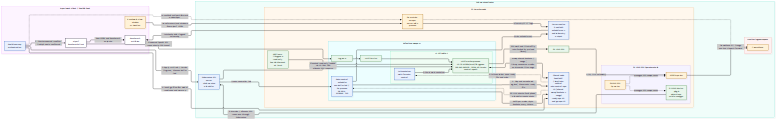
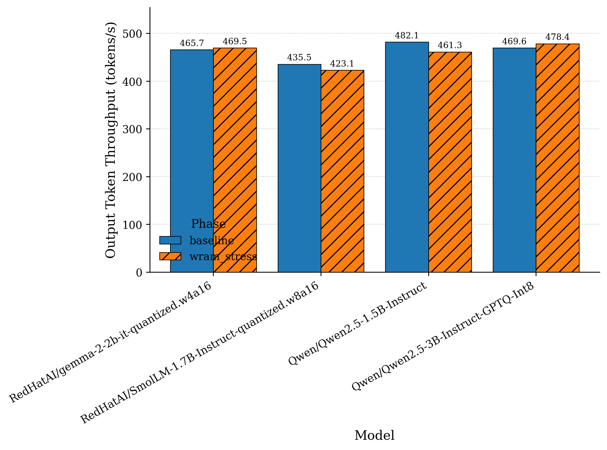
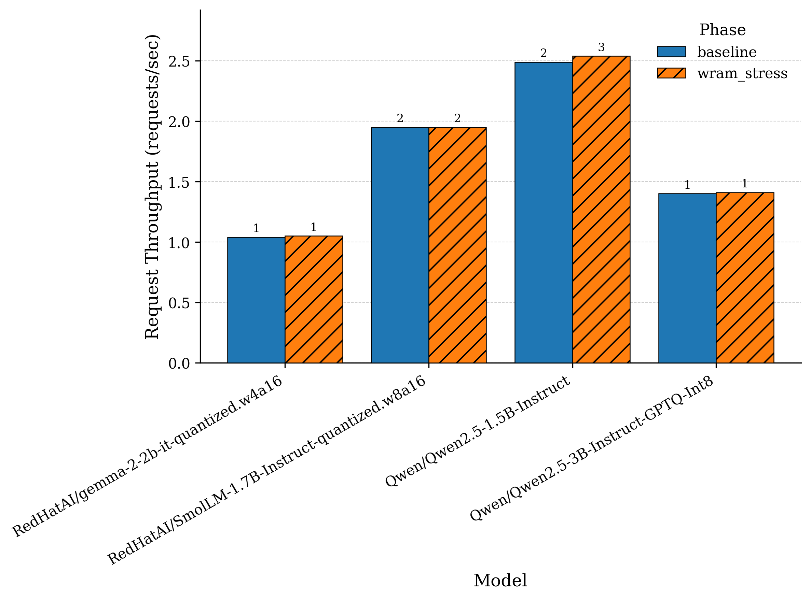
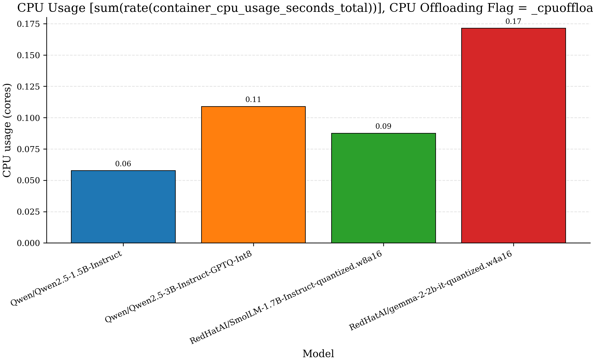

# Architecture


# CPU and RAM Stress
```
apiVersion: v1
kind: Pod
metadata:
  name: ram-bandwidth-stress
  labels:
    app.kubernetes.io/name: ram-bandwidth-stress
spec:
  # Never restart: a restart would re-run apt-get and silently interrupt the load.
  restartPolicy: Never
  terminationGracePeriodSeconds: 5
  # Must share a node with the vLLM pods, otherwise there is no memory contention.
  # Matches any pod that belongs to a Job; narrow the selector if other Jobs exist.
  affinity:
    podAffinity:
      requiredDuringSchedulingIgnoredDuringExecution:
        - topologyKey: kubernetes.io/hostname
          labelSelector:
            matchExpressions:
              - key: job-name
                operator: Exists
  containers:
    - name: stress
      image: debian:bookworm-slim
      command: ["/bin/sh", "-c"]
      args:
        - |
          set -e
          apt-get update -qq
          apt-get install -y -qq stress-ng procps
          exec stress-ng --stream 4 --timeout 3h
      # Ready only once stress-ng is actually running (not just when the container started).
      readinessProbe:
        exec:
          command: ["pgrep", "-x", "stress-ng"]
        periodSeconds: 5
        failureThreshold: 120
      resources:
        requests:
          cpu: "4"
          memory: "8Gi"
        limits:
          cpu: "4"
          memory: "8Gi"
```




# PCIe Stress Test (Rate Control Verification)


