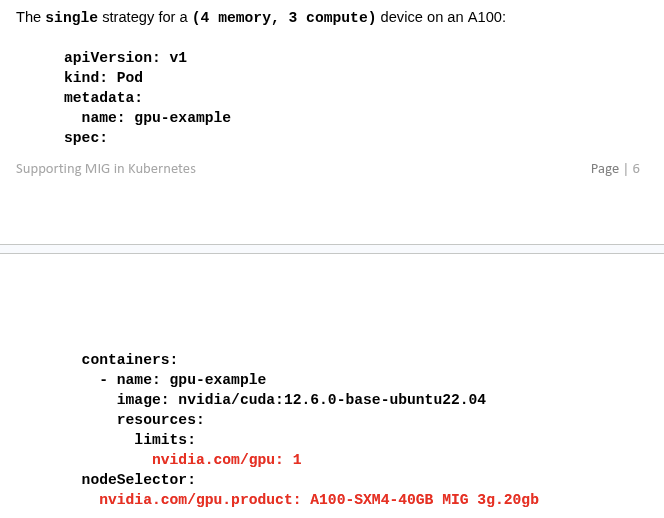
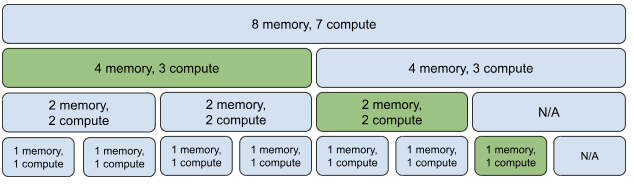
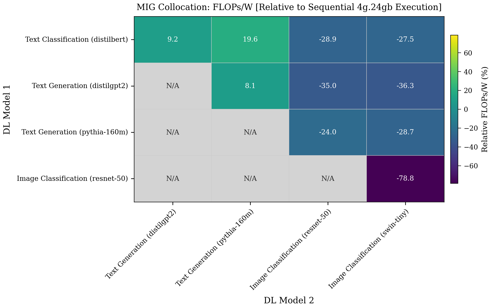
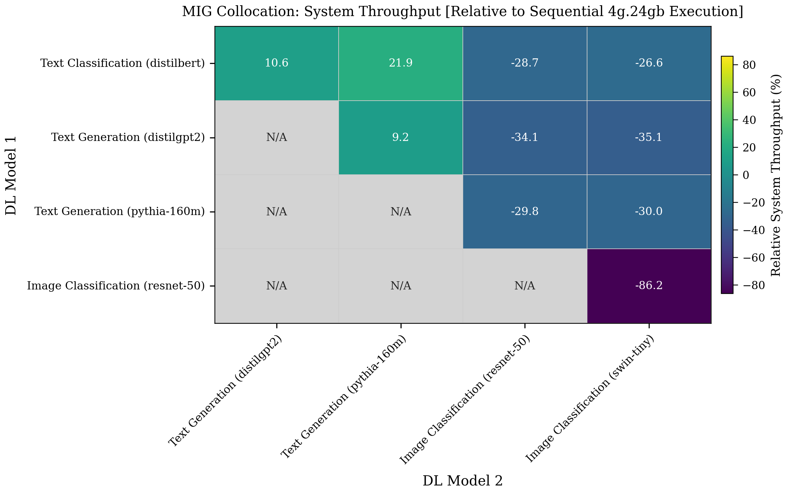

# Motivation
* Multi-tenant system. 
* Multi-instance GPU (MIG).
* Jobs are deep learning tasks (training/fine-tuning/hyperparameter optimization/inference).
* Naive collocation of jobs may degrade overall system efficiency.

<table>
  <tr>
    <td></td>
    <td></td>
  </tr>
  <tr>
    <td></td>
    <td></td>
    <td></td>
  </tr>
</table>

# Problem Definition
## Formulation
$$\begin{equation}
\max_s(FpW)
\end{equation}$$

where:
* $s$: strategy (group of actions)

## FpW or Throughput:
* Theorem: Maximizing FpW implicitly maximizes throughput. Proof:
$$\begin{equation}
\max_s(FpW) = \max_s(\frac{\frac{step}{second}\times \frac{flops}{step}}{power}) = \max_s(\alpha \cdot \frac{step}{second})
\end{equation}$$

* Throughput requires compromising jobs privacy

 

